This notebook contains the step by step guide for the las work (Practica) done in "Big Data Architechture" belonging to the Big Data, Machine Learning and Artificial Intelligence from KeepCoding Tech Institute.

**Main goal: Set up a connection between Hive and an ElasticSearch Index on Hadoop**

Brief explanation of the terms used above

- Hadoop:

    - Hadoop is an open-source software framework that helps companies store, manage, and process vast amounts of data across multiple computers.
    - It was designed to handle "big data" by breaking down large data tasks and distributing them across a network of computers, making it faster  and more efficient to analyze huge datasets.
    - Hadoop includes different tools for specific tasks, such as storing data (HDFS) and processing it (MapReduce).

- Hive:

    - Hive is a data tool that works on top of Hadoop and allows users to interact with their data using an SQL-like language (SQL is a popular database language).
    - With Hive, users can analyze and query large datasets stored in Hadoop as if they were working with a traditional database, but on a much larger scale.
    - This tool is especially helpful for users who want to use familiar SQL commands to access and manipulate their big data stored in Hadoop.

- Elasticsearch:

    - Elasticsearch is a search engine and data analytics tool that makes it easy to search, analyze, and explore data in real time.
    - It allows companies to store their data in a way that’s optimized for fast searching, which is useful for applications like website searches, data dashboards, and real-time monitoring.
    - Unlike traditional databases, which can be slow for searching, Elasticsearch is built to retrieve specific information quickly, even from huge datasets.

- Elasticsearch Index:

    - An Elasticsearch index is like a database or folder where data is stored within Elasticsearch, organized in a way that makes it easy to search through.
    - An index allows Elasticsearch to quickly locate and retrieve specific data points, making it possible to perform fast searches and complex analytics on large amounts of data.
    - It’s structured to support a wide variety of data formats, including text, numbers, and even JSON documents.
    - This setup—connecting Hadoop (with Hive) and Elasticsearch—provides both the powerful storage and processing of Hadoop and the fast search and real-time analytics of Elasticsearch, giving users the best of both worlds in big data management.


## Part 1
ES-Hadoop Config

- Create a cluster with the given jar files (elasticsearch config and commons-http client)
- ELK of Elastic Search (ELK stands for Elastic, Logstash and Kibana)

For the cluster creation, ubuntu 20.04 was selected as the OS, as the works and classes has been proved on that OS

Archives loaded into bucket with ElasticSearch & Hadoop config

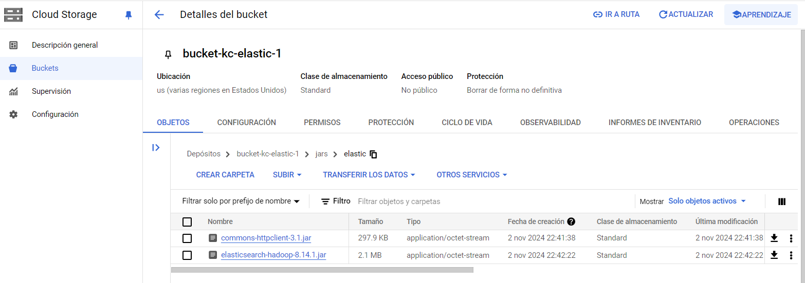

Hadoop cluster created (1 master, 2 workers)

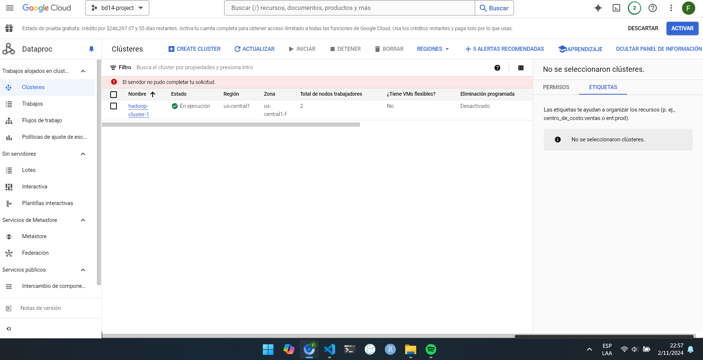

SSH into cluster master to load the hadoop and kibana jar config files 

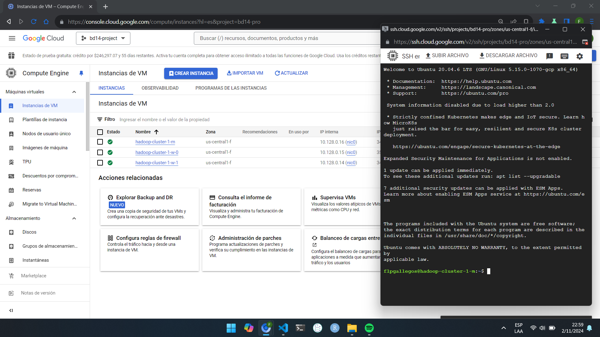

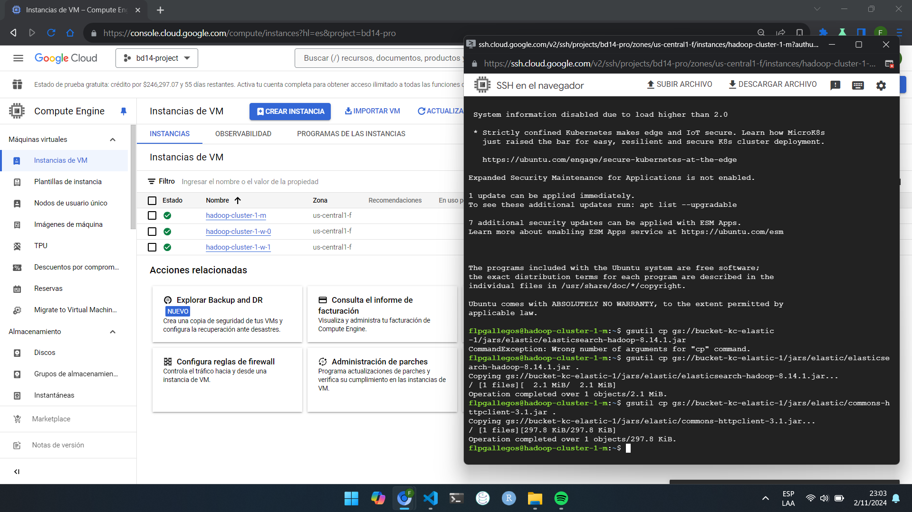

# Configure server ElasticSearch

1st, we need to create a VM (or instance) for elasticsearch

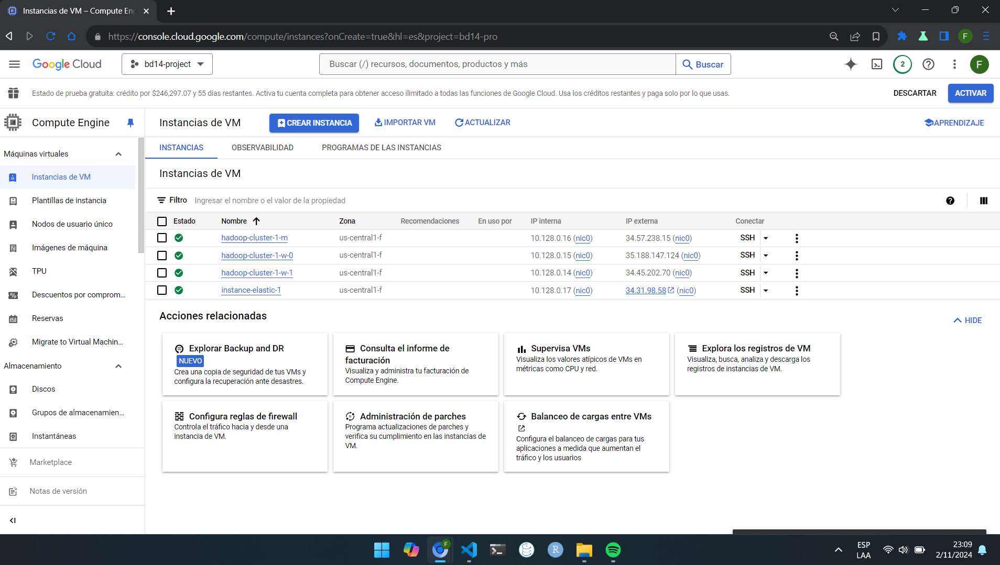

### Important

Personal IP 191.xxx.xxx.xxx

Cluster Master IP : 34.57.238.15

Elastic IP: 34.31.98.58


We need to be able to communicate to the cluster master, so we add a firewall rule allowing **elastic instance and my personal computer** access to ports 9200 (elastic) and 5601 (kibana)

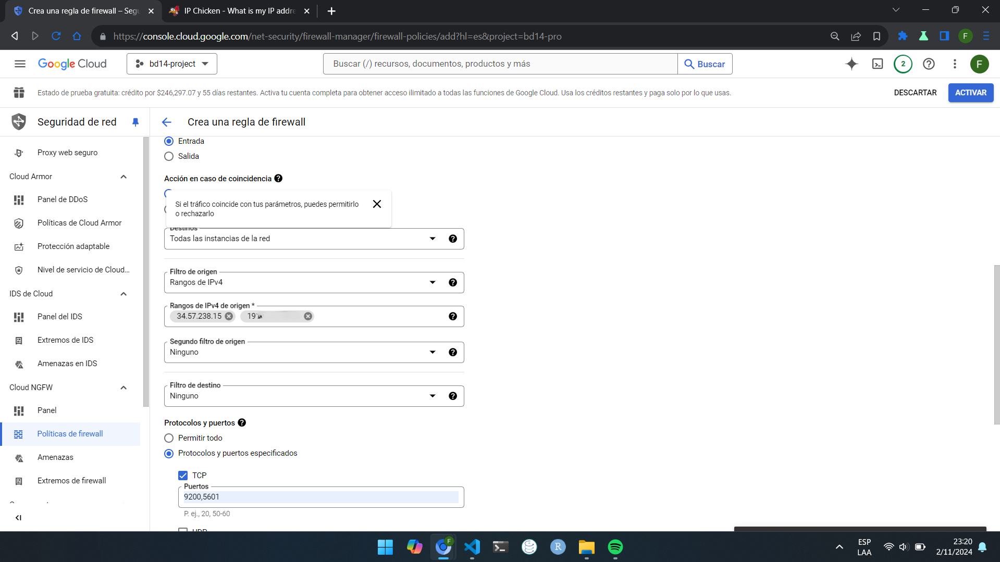

After failed attemps to connect to the elastic instance, checking the firewall, reviewing archives. I realized that i didint install elastic and kibana on the instance

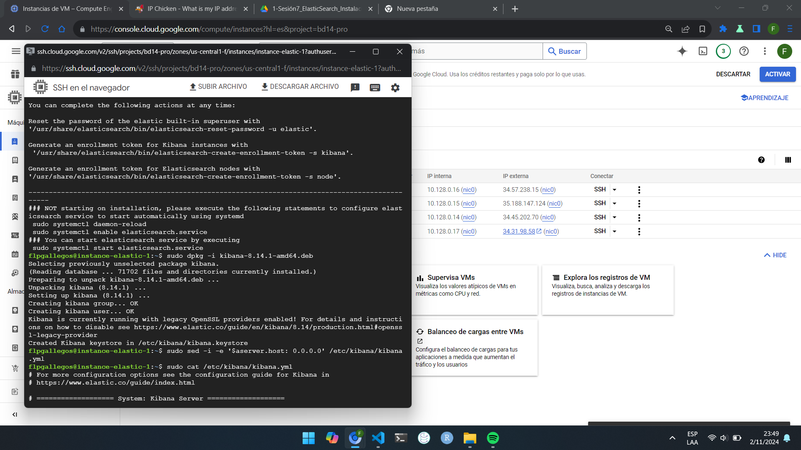

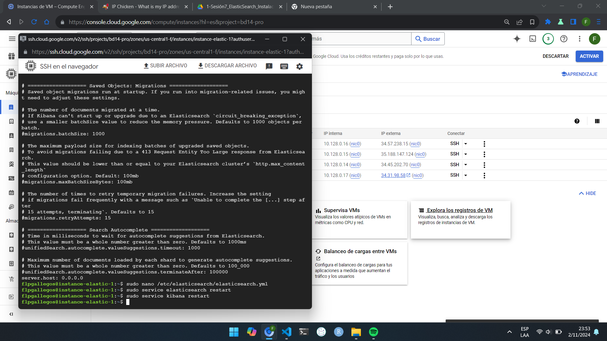

config modified and services restarted.

So, after installing elastic search and kibana on the VM we can connect to it through the master of the cluster (left side shell corresponds to the elastic instance, righ side corresponds to the cluster master)

After configuration, I was able to connect through elastic instance an my pc (check last lines in right shell, and following picture)

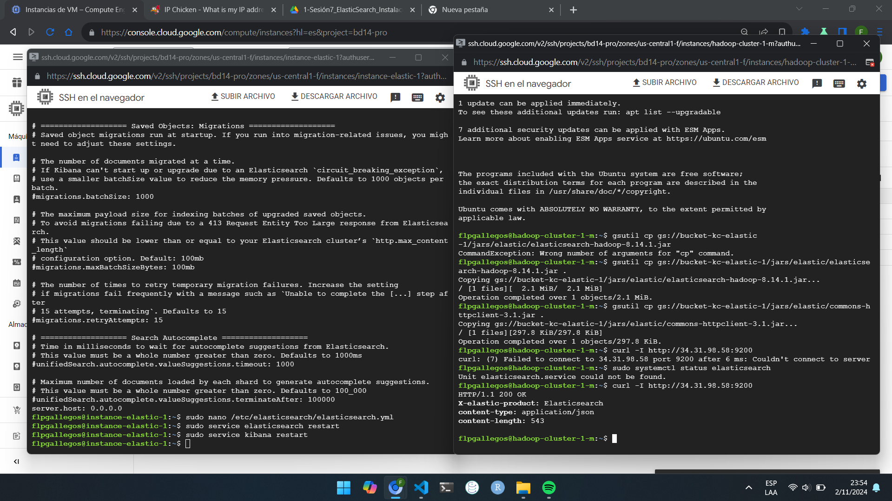

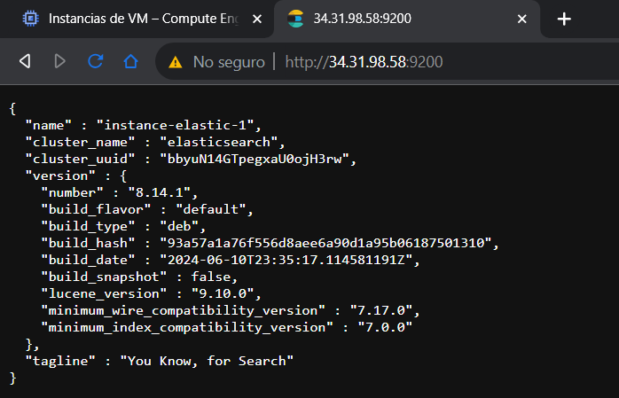

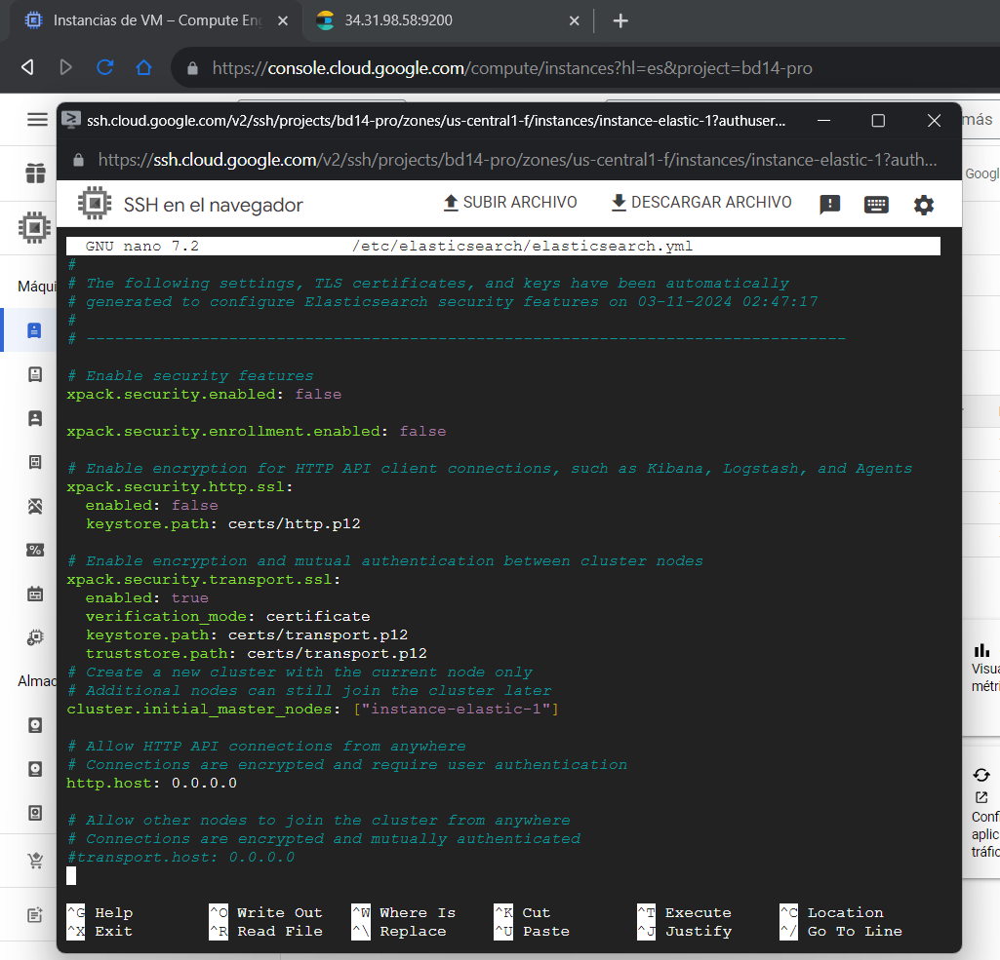

hive configuration on cluster's master

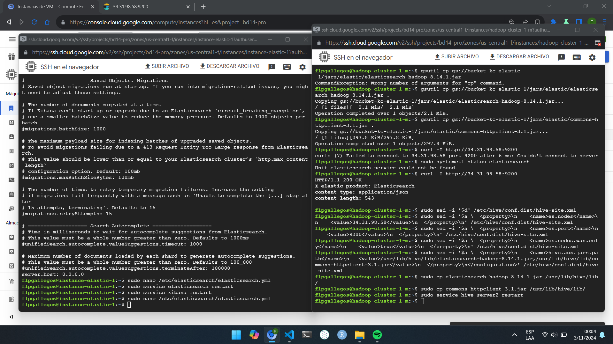

The file was modified to ahve more data about the students, also the column "id" was renamed to "code" to avoid confusions with the _id, values were changed to other more realistic
```{json}
{ "index": { "_index": "alumnos", "_id": "3" } }
{ "code": "1003", "name": "Carlos", "last_name": "González", "age": 22, "email": "carlos.gonzalez@example.com", "enrollment_date": "2022-01-15" }
{ "index": { "_index": "alumnos", "_id": "4" } }
{ "code": "1004", "name": "María", "last_name": "López", "age": 21, "email": "maria.lopez@example.com", "enrollment_date": "2022-02-10" }
{ "index": { "_index": "alumnos", "_id": "5" } }
{ "code": "1005", "name": "Luis", "last_name": "Martínez", "age": 23, "email": "luis.martinez@example.com", "enrollment_date": "2022-03-05" }
{ "index": { "_index": "alumnos", "_id": "6" } }
{ "code": "1006", "name": "Sofía", "last_name": "Ramírez", "age": 20, "email": "sofia.ramirez@example.com", "enrollment_date": "2022-04-20" }
{ "index": { "_index": "alumnos", "_id": "7" } }
{ "code": "1007", "name": "Pedro", "last_name": "Hernández", "age": 24, "email": "pedro.hernandez@example.com", "enrollment_date": "2022-05-12" }
{ "index": { "_index": "alumnos", "_id": "8" } }
{ "code": "1008", "name": "Ana", "last_name": "García", "age": 19, "email": "ana.garcia@example.com", "enrollment_date": "2022-06-30" }
{ "index": { "_index": "alumnos", "_id": "9" } }
{ "code": "1009", "name": "Javier", "last_name": "Morales", "age": 22, "email": "javier.morales@example.com", "enrollment_date": "2022-07-18" }
{ "index": { "_index": "alumnos", "_id": "10" } }
{ "code": "1010", "name": "Lucía", "last_name": "Castillo", "age": 21, "email": "lucia.castillo@example.com", "enrollment_date": "2022-08-25" }
```


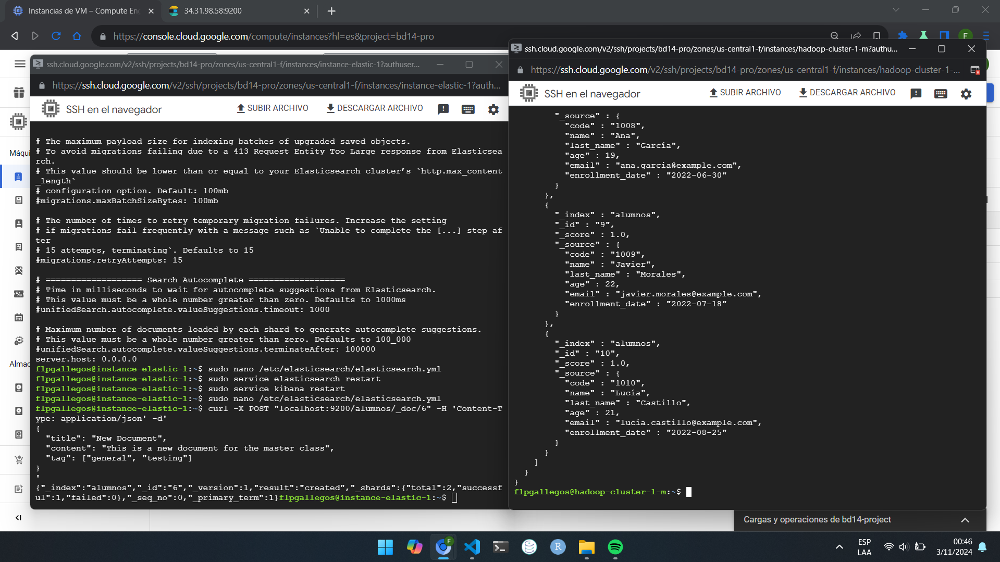

kibana time!

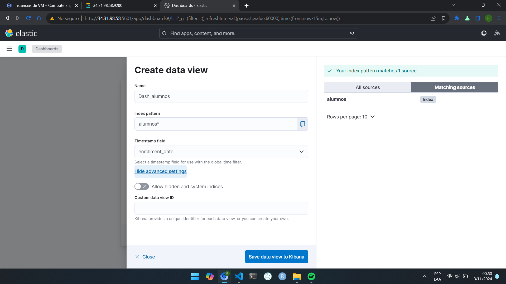

I tried to make a frequency graph for the student's ages

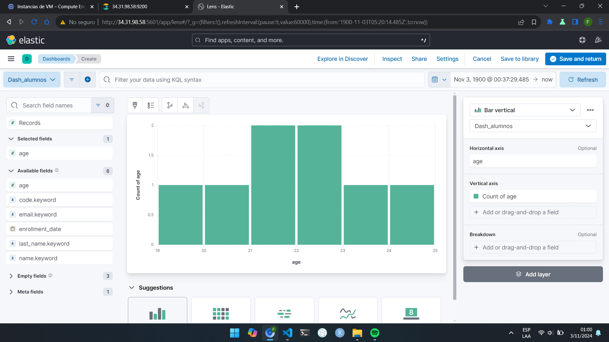

but as the index has just a few documents, I chose a more appropiate graph for it, like this pie chart

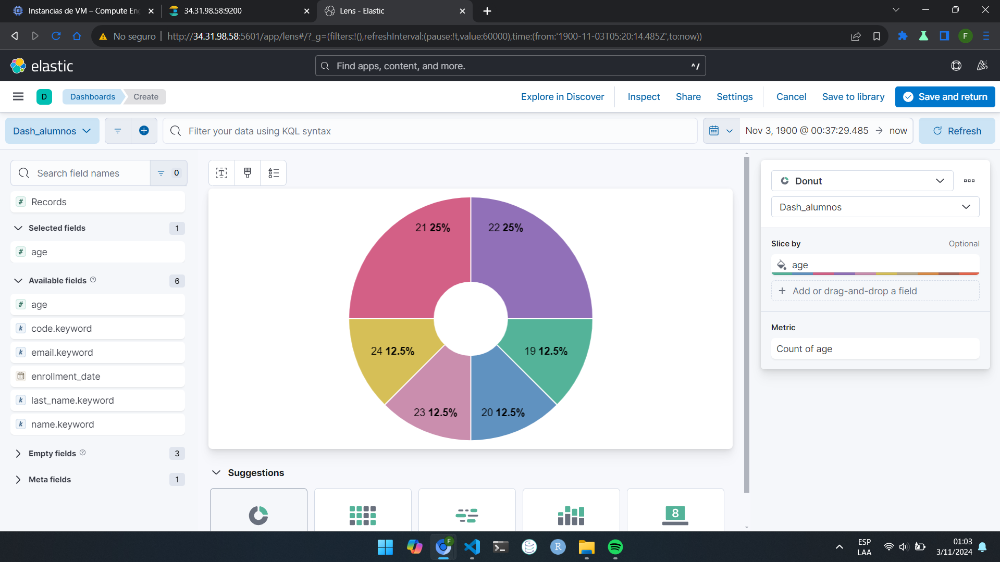

Final view of the dashboard

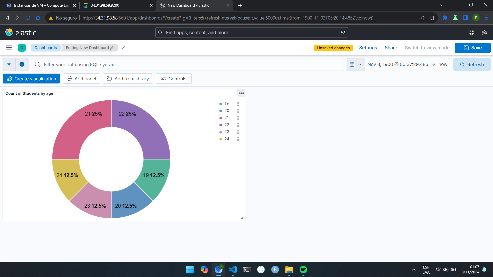
