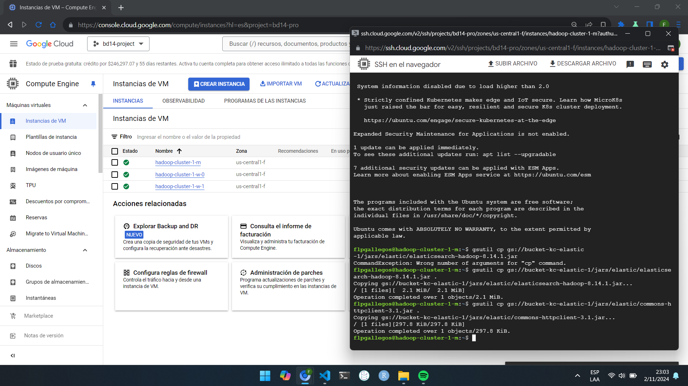
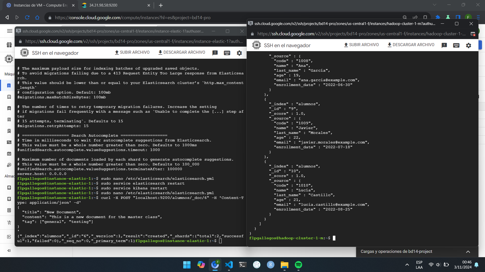

This file corresponds to a brief summary of <u>[Practica BDA Walkthrough **(Click me!)**](https://www.github.com/CookieDelta/BDArch_Practica)</u>

Felipe Gallegos, Big Data, ML & AI Fullstack Bootcamp student

ENTREGABLE PARTE 1: Captura de pantalla de la consola SSH del cluster Hadoop una vez finalizada la configuración y carga.

  
\newpage

ENTREGABLE PARTE 2: Captura de pantalla de la consola del server Elastic donde se vea la configuración de elastic, desde 'Enable security features' hasta el final

  
\newpage

ENTREGABLE PARTE 3: Captura de pantalla del proceso de configuración en Cluster Hadoop de Conexión con ES completo.

  
\newpage

ENTREGABLE PARTE 4: Captura de pantalla de la consola del cluster Hadoop con el resultado la consulta.

  
\newpage

ENTREGABLE 5: Opcional. Captura de pantalla de la consola de Kibana con alguna visualización sencilla.

